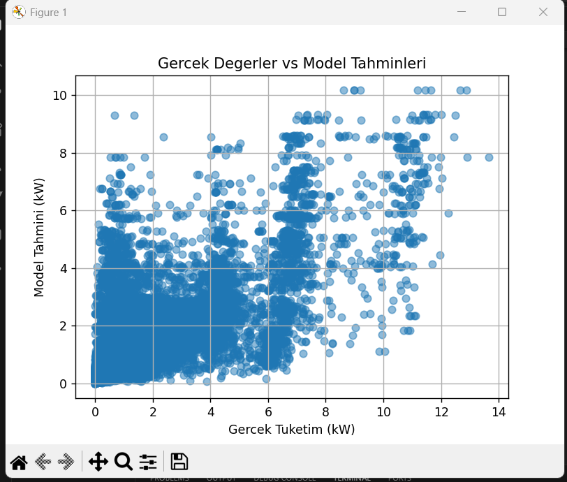
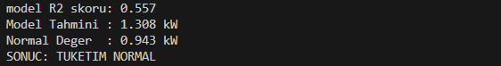
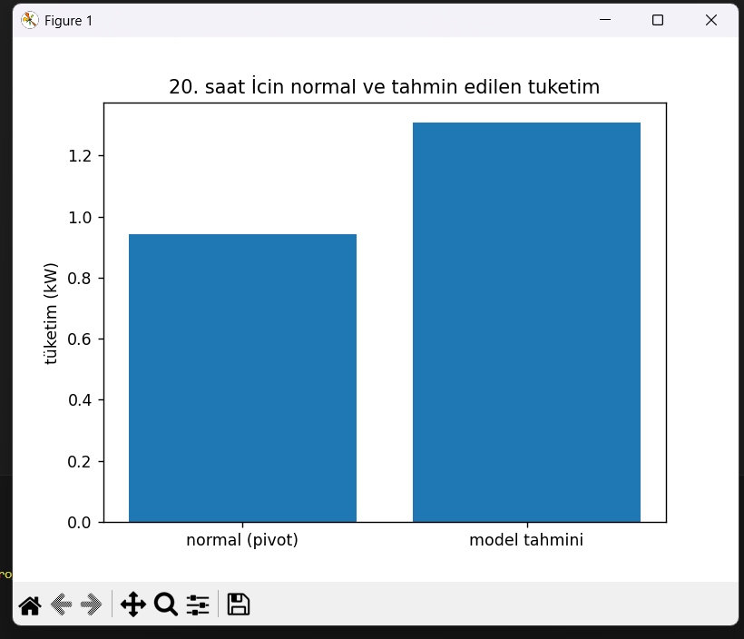

# Akıllı Ev Enerji Tüketimi Analizi ve Tahmini

Bir akıllı eve ait enerji tüketim verileri kullanılarak
ML ile tüketim tahmini yapılmasını ve
bu tahminlerin geçmişteki **normal tüketim alışkanlıkları** ile
karşılaştırılmasını amaçlamaktadır.

Model çıktılarının yorumlanabilmesi için bir referans değere (baseline)
ihtiyaç vardır bu da **pivot tablo kullanımı** ile yapılmıştr. 

---

- Saat ve çevresel koşullara göre evin enerji tüketimini tahmin etmek  
- Geçmiş verilere bakarak evin **normal tüketim davranışını** çıkarmak  
- Tahmin edilen değer ile normal değer arasında karşılaştırma yaparak
  tüketimin **normal mi yoksa anormal mi** olduğunu yorumlamak  

---

## Kullanılan Veri Seti

Veri setinde aşağıdaki bilgiler vardır:

- Zaman bilgisi (Unix time)
- Toplam enerji tüketimi (kW)
- Sıcaklık (`temperature`)
- Nem (`humidity`)
- Basınç (`pressure`)

Zaman verisi saat bilgisine dönüştürülmüştür.

---

## Pivot Tablo

- Günün her saati için
- Evin geçmişteki **ortalama enerji tüketimi** hesaplanmıştır

Bu tablo, evin alışkanlıklarını temsil eden
sayısal bir **baseline** olarak kullanılmıştır.

### Pivot Tablo Neden Lazım?

Model yalnızca bir sayı tahmin eder.
Ancak bu sayının:

- normal mi
- yoksa anormal mi

olduğunu anlayabilmek için geçmişteki normal davranışı bilmek şart-gerekli.
Pivot tablosuz tahmin olabilir ama yorum mantıklı olmaz.

---

## Kullanılan Makine Öğrenmesi Modeli

Bu proje bir regresyon problemidir.
Çünkü tahmin edilen değer enerji tüketimi sürekli bir sayıdır.

### Kullanılan Model
- Random Forest Regressor

### Neden Random Forest?
- Random Forest karmaşık ilişkileri iyi öğrenir
- Gürültülü verilerde daha kararlı sonuçlar verir

Model başarımı R2 skoru ile ölçülmüştür.

---

### 1. Gerçek Değerler vs Model Tahminleri

Aşağıdaki grafik, modelin gerçek tüketim değerlerine
ne kadar yakın tahminler yaptığını göstermektedir.

  
Noktalar diyagonal çizgiye yaklaştıkça modelin başarımı artar.
Grafik genel olarak modelin eğilimi öğrendiğini göstermektedir.

---

### 2. Model Çıktısı ve Sayısal Sonuçlar

Aşağıda modelin R2 skoru,
seçilen saat için yaptığı tahmin
ve pivot tablodan gelen normal değer görülmektedir.

Modelin ürettiği tahmin,
pivot tablodan gelen normal değer ile karşılaştırılarak
tüketimin normal olduğu sonucuna varıyoruz.

---

### 3. Normal Tüketim vs Modelin Tahmini

Seçilen bir saat için,
normal tüketim ile modelin tahmini aşağıdaki grafikte görülmekte.

 
Bu grafik, pivot tablonun neden kullanıldığını birkez daha bize göstermektedir.

---

## SUM

Bu proje:

- Pivot tablo kullanılarak evin normal enerji tüketim profili çıkarılmış
- Makine öğrenmesi modeli ile tüketim tahmini yapılmış
- Tahminler, pivot tablodaki normal değerlerle karşılaştırılmıştır

**Bu yaklaşım, akıllı ev sistemlerinde
anormal enerji tüketimlerinin tespit edilmesi için
gerçek hayatta kullanılabilir..**

---
